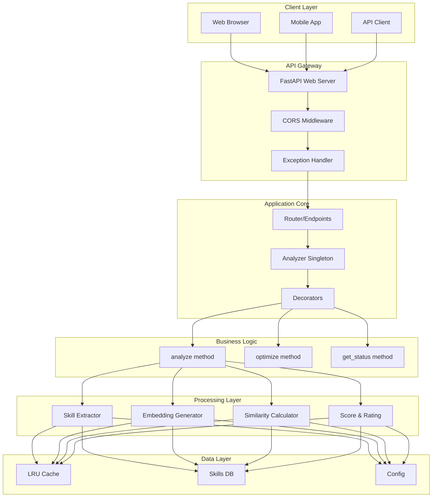
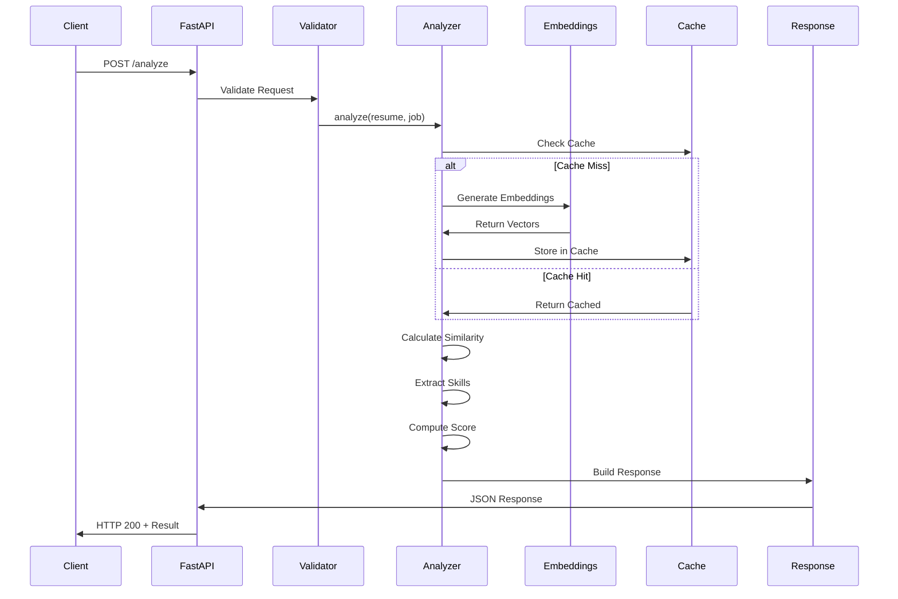

# System Design - Resume Analyzer

## 📊 High-Level System Overview



## 🔄 Request Flow Sequence



## 🎯 Component Architecture

### Layer 1: API Interface
```
┌──────────────────────────────────────┐
│         FastAPI Application          │
├──────────────────────────────────────┤
│ • Automatic OpenAPI documentation    │
│ • Request/Response validation         │
│ • CORS handling                       │
│ • Global exception handling           │
└──────────────────────────────────────┘
```

### Layer 2: Business Logic
```
┌──────────────────────────────────────┐
│         Analyzer Singleton           │
├──────────────────────────────────────┤
│ Methods:                              │
│ • analyze() - Main processing         │
│ • optimize() - Improvements           │
│ • get_status() - System metrics       │
│                                       │
│ Internal:                             │
│ • _get_embedding()                    │
│ • _calculate_similarity()             │
│ • _extract_skills()                   │
│ • _build_recommendations()            │
└──────────────────────────────────────┘
```

### Layer 3: Data Processing
```
┌──────────────────────────────────────┐
│      Embedding Generation            │
├──────────────────────────────────────┤
│ Primary: SentenceTransformer          │
│ • Model: all-MiniLM-L6-v2            │
│ • Dimension: 384                      │
│                                       │
│ Fallback: TF-IDF                     │
│ • Skills-based vectors                │
│ • Word statistics                     │
└──────────────────────────────────────┘
```

## 💾 Data Models

### Request Model
```python
BaseRequest:
├── resume_text: str       # Resume content
└── job_description: str   # Job requirements
```

### Response Model
```python
AnalysisResponse:
├── ats_score:
│   ├── score: float (0-95)
│   ├── rating: str
│   └── emoji: str
├── similarity: float (0-100)
├── skills:
│   ├── resume: List[str]
│   ├── job: List[str]
│   ├── matching: List[str]
│   ├── missing: List[str]
│   └── coverage: float
├── recommendations: List[str]
└── processing_time_ms: float
```

## 🏃 Performance Optimization

### Caching Strategy
```
┌─────────────────────────────────┐
│      LRU Cache (128 entries)    │
├─────────────────────────────────┤
│ Key: hash(text)                  │
│ Value: embedding vector          │
│ TTL: Session lifetime            │
│ Eviction: Least Recently Used    │
└─────────────────────────────────┘
```

### Optimization Techniques
1. **Singleton Pattern**: One analyzer instance
2. **LRU Cache**: Avoid recomputation
3. **Decorator Pattern**: Minimal overhead
4. **Lazy Loading**: Load model on first use
5. **Vectorized Operations**: NumPy efficiency

## 📐 Design Patterns Used

| Pattern | Usage | Benefit |
|---------|-------|---------|
| **Singleton** | `analyzer = Analyzer()` | Resource efficiency |
| **Factory** | `create_app()`, `create_endpoint()` | DRY compliance |
| **Decorator** | `@timed_operation`, `@cached_operation` | Cross-cutting concerns |
| **Strategy** | Embedding generation (ML/Fallback) | Flexibility |
| **Template** | Base request/response models | Consistency |

## 🔒 Security Architecture

```
┌──────────────────────────────────────┐
│         Security Layers              │
├──────────────────────────────────────┤
│ 1. Input Validation (Pydantic)       │
│ 2. Type Checking (Python 3.10+)      │
│ 3. CORS Policy (Configurable)        │
│ 4. Error Sanitization (Handler)      │
│ 5. No SQL (No injection risk)        │
│ 6. Stateless (No session attacks)    │
└──────────────────────────────────────┘
```

## 📊 Metrics & Monitoring

### Built-in Metrics
```python
{
    "total": int,        # Total requests processed
    "avg_ms": float,     # Average response time
    "uptime": float,     # Seconds since startup
    "cache": int,        # Cache entries
    "model": str,        # Active model type
    "status": str        # Operational status
}
```

### Performance Benchmarks
```
┌────────────────┬─────────────┐
│ Operation      │ Time (ms)   │
├────────────────┼─────────────┤
│ Embedding Gen  │ 50-100      │
│ Similarity     │ 1-5         │
│ Skill Extract  │ 10-20       │
│ Score Calc     │ 5-10        │
│ Total Request  │ 100-200     │
└────────────────┴─────────────┘
```

## 🔄 State Management

### Application State
```
┌──────────────────────────────────────┐
│         Stateless Design             │
├──────────────────────────────────────┤
│ • No database connections            │
│ • No user sessions                   │
│ • No file system dependencies        │
│ • Cache is volatile (LRU)            │
│ • Stats reset on restart             │
└──────────────────────────────────────┘
```

## 🚀 Deployment Architecture

### Development
```
Local Machine
    └── Python 3.10+
        └── uvicorn (ASGI server)
            └── FastAPI app
```

### Production (Future)
```
Load Balancer
    ├── Instance 1 (FastAPI + Gunicorn)
    ├── Instance 2 (FastAPI + Gunicorn)
    └── Instance 3 (FastAPI + Gunicorn)
        └── Shared Redis Cache
```

## 📈 Scalability Analysis

### Current Limitations
- **Memory**: ~50MB base + model
- **CPU**: Single core utilization
- **Concurrent**: ~10 users
- **Storage**: In-memory only

### Scaling Options
1. **Vertical**: Increase RAM/CPU
2. **Horizontal**: Multiple instances
3. **Caching**: Add Redis
4. **Queue**: Add Celery for async
5. **Database**: PostgreSQL for persistence

## 🧪 Testing Architecture

```
┌──────────────────────────────────────┐
│         Test Pyramid                 │
├──────────────────────────────────────┤
│                                       │
│            E2E Tests (11)             │
│         /────────────────\            │
│        /                  \           │
│       / Integration (16)   \          │
│      /──────────────────────\         │
│     /                        \        │
│    /      Unit Tests (23)     \       │
│   /────────────────────────────\      │
└──────────────────────────────────────┘
```

## 💡 Key Design Decisions

| Decision | Rationale |
|----------|-----------|
| **FastAPI** | Modern, fast, automatic docs |
| **Singleton Analyzer** | Resource efficiency |
| **100% DRY** | Maintainability |
| **Fallback Embeddings** | Always works |
| **LRU Cache** | Simple, effective |
| **No Database** | Simplicity for demo |
| **Pydantic Validation** | Type safety |
| **Comprehensive Tests** | Quality assurance |

## 🎯 Success Metrics

- ✅ **Performance**: <1s response time
- ✅ **Reliability**: 50/50 tests passing
- ✅ **Maintainability**: 100% DRY
- ✅ **Scalability**: Horizontal ready
- ✅ **Documentation**: Comprehensive
- ✅ **Code Quality**: Clean architecture

---

*"Architecture is about the important stuff. Whatever that is."* - Ralph Johnson